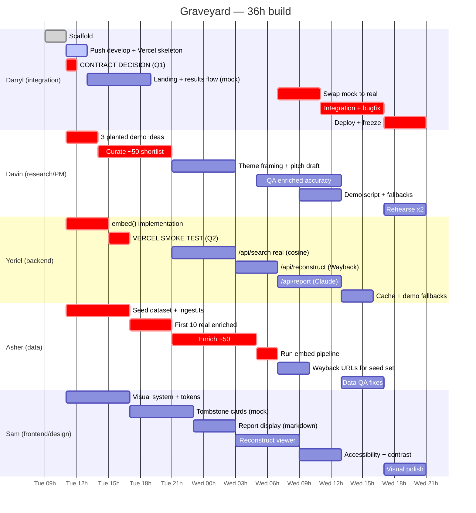
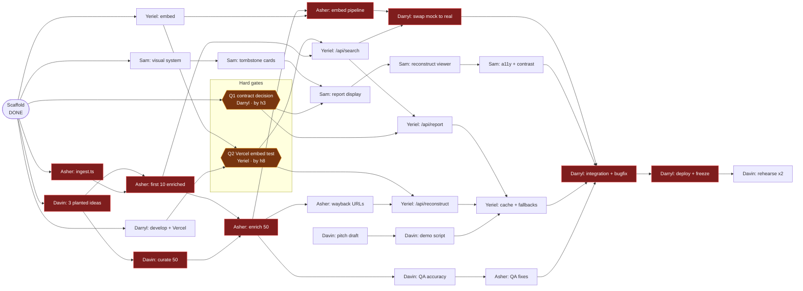

# Build schedule — 36 hours

Owner: **Darryl**. Derived from the phase table in [GRAVEYARD_TEAM_PLAN.md](../GRAVEYARD_TEAM_PLAN.md).

Hours are **offsets from kickoff**, not clock times. The Gantt below is anchored
to a placeholder start of `2026-09-01 09:00` — shift every date by the same
amount if we start elsewhere. Phase 0 is done.

## Gantt



## What depends on what



## The critical path — zero slack

```
Scaffold → 3 planted ideas (Davin) → first 10 enriched (Asher)
        → enrich 50 → embed pipeline → swap to real (Darryl)
        → integration + bugfix → deploy + freeze
```

**The non-obvious part: Davin is on the critical path at hour 2.** The planted
demo ideas gate the seed curation, which gates the entire enrichment chain,
which gates integration. A research task blocks all the engineering. If Davin's
shortlist slips 3 hours, the deploy slips 3 hours.

Everything else has slack. Sam's whole track and Yeriel's report work can run
late without moving the finish — which is also why **they are the right things
to cut** if we fall behind.

## Three hard gates

| By hour | Gate | Owner | If it fails |
|---|---|---|---|
| **3** | Report inline in `/api/search`, or separate `/api/report` call? | Darryl | Yeriel builds the wrong thing and Sam's report display is rebuilt |
| **5** | The 3 planted demo ideas exist | Davin | Entire data chain slips 1:1 |
| **8** | `@xenova/transformers` proven working **on Vercel**, not just locally | Yeriel | Fall back to build-time vectors + query-side keyword/cosine hybrid. Finding this out at hour 32 is fatal |

## Cut order if we fall behind

From the team plan, in this order: **(1)** Supabase — already deferred,
**(2)** Wayback reconstruction → fall back to a screenshot, **(3)** live
`/api/report` → fall back to pre-generated reports for the planted ideas.

**Never cut the semantic match.** That's the core, and it's 30 of the 70 points.
